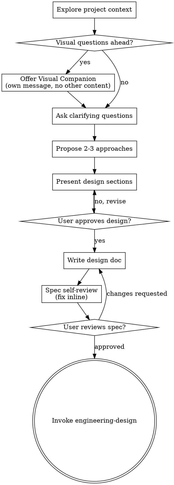

# Brainstorming Ideas Into Designs

Help turn ideas into fully formed designs and specs through natural collaborative dialogue.

Start by understanding the current project context, then ask questions one at a time to refine the idea. Once you understand what you're building, present the design and get user approval.

<HARD-GATE>
Do NOT invoke `engineering-design`, `writing-plans`, write code, scaffold a project, or take implementation action until you have presented a design and the user has approved it. This applies to every project regardless of perceived simplicity.
</HARD-GATE>

## Anti-Pattern: "This Is Too Simple To Need A Design"

Every project goes through this process. A todo list, a utility, a config change, or a one-screen prototype all still need design clarification. The design can be short if the task is truly small, but you MUST present it and get approval.

## Checklist

You MUST create a task for each of these items and complete them in order:

1. **Explore project context** - check files, docs, recent commits
2. **Offer visual companion** (if topic will involve visual questions) - this is its own message, not combined with a clarifying question. See the Visual Companion section below.
3. **Ask clarifying questions** - one at a time, understand purpose, constraints, and success criteria
4. **Propose 2-3 approaches** - with trade-offs and your recommendation
5. **Present design** - in sections scaled to their complexity, get user approval after each section
6. **Write design doc** - save to `docs/superpowers/specs/YYYY-MM-DD-<topic>-design.md`
7. **Spec self-review** - quick inline check for placeholders, contradictions, ambiguity, and scope
8. **User reviews written spec** - ask user to review the spec file before proceeding
9. **Transition to engineering design** - invoke `engineering-design`

## Process Flow

**The terminal state is invoking `engineering-design`.** Do NOT invoke `writing-plans` directly from brainstorming.

## The Process

**Understanding the idea:**

- Check the current project state first: files, docs, recent commits, repo shape
- Assess scope before diving into details: if the request actually contains multiple independent systems, decompose the work first
- If the project is too large for a single spec, help the user decompose it into sub-projects, then brainstorm the first one through the normal flow
- For appropriately-scoped work, ask questions one at a time
- Prefer multiple choice when possible
- Focus on purpose, constraints, success criteria, and intended user experience

**Exploring approaches:**

- Propose 2-3 approaches with trade-offs
- Lead with your recommended option and explain why
- Keep the comparison concrete enough to help later design decisions

**Presenting the design:**

- Present the design once you believe you understand the target
- Scale each section to the complexity of the decision
- Ask after each section whether it looks right so far
- Cover the product/design level concerns: architecture, components, flows, states, error handling, testing expectations
- Be ready to go back and clarify if something does not make sense

**Working in existing codebases:**

- Explore the current structure before proposing changes
- Follow local patterns unless there is a clear reason to change them
- Include only targeted cleanup that serves the current goal
- Do not propose unrelated refactoring

## After the Design

**Documentation:**

- Write the validated design spec to `docs/superpowers/specs/YYYY-MM-DD-<topic>-design.md`
  - user preferences for location override this default

**Spec Self-Review:**

After writing the spec document, review it with fresh eyes:

1. **Placeholder scan** - any `TBD`, vague sections, or hidden unresolved requirements? Fix them.
2. **Internal consistency** - do any sections contradict each other?
3. **Scope check** - is this focused enough for a single engineering design flow?
4. **Ambiguity check** - could any requirement be interpreted multiple ways? If so, make it explicit.

Fix issues inline before asking the user to review.

**User Review Gate:**

After the self-review passes, ask the user to review the written spec before proceeding. If they request changes, make them and re-run the self-review loop. Only proceed once the user approves.

**Engineering Handoff:**

- Invoke `engineering-design` after the spec is approved
- Do NOT invoke `writing-plans` directly from `brainstorming`

## Key Principles

- **One question at a time**
- **Multiple choice preferred**
- **YAGNI ruthlessly**
- **Explore alternatives**
- **Incremental validation**
- **Be flexible**

## Visual Companion

A browser-based companion for showing mockups, diagrams, and visual options during brainstorming. Available as a tool, not a mode. Accepting the companion means it is available for questions that benefit from visuals; it does not mean every question goes through the browser.

**Offering the companion:** When upcoming questions will likely benefit from visual treatment, offer it once in its own message:

> "Some of what we're working on might be easier to explain if I can show it to you in a web browser. I can put together mockups, diagrams, comparisons, and other visuals as we go. This feature is still new and can be token-intensive. Want to try it? (Requires opening a local URL)"

Do not combine this offer with clarifying questions or any other content.

If the user agrees, read:
- `skills/brainstorming/visual-companion.md`

Then decide per question whether browser or terminal is the better medium.
