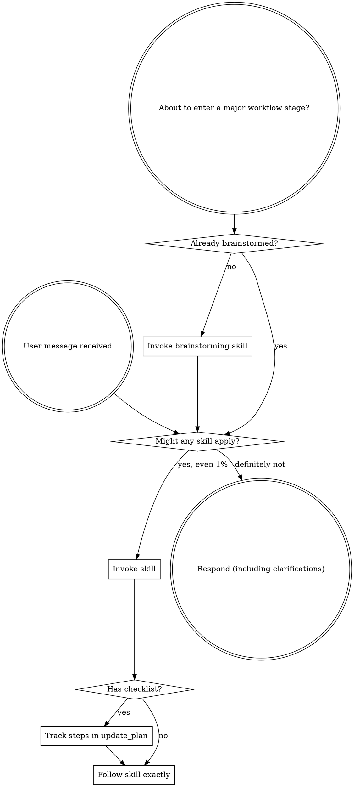

<SUBAGENT-STOP>
If you were dispatched as a subagent to execute a specific task, skip this skill.
</SUBAGENT-STOP>

<EXTREMELY-IMPORTANT>
If you think there is even a 1% chance a skill might apply to what you are doing, you ABSOLUTELY MUST invoke the skill.

IF A SKILL APPLIES TO YOUR TASK, YOU DO NOT HAVE A CHOICE. YOU MUST USE IT.

This is not negotiable. This is not optional. You cannot rationalize your way out of this.
</EXTREMELY-IMPORTANT>

## Instruction Priority

Superpowers skills override default system prompt behavior, but **user instructions always take precedence**:

1. **User's explicit instructions** (`AGENTS.md`, direct requests, project instructions) - highest priority
2. **Superpowers skills** - override default system behavior where they conflict
3. **Default system prompt** - lowest priority

If `AGENTS.md` says "don't use TDD" and a skill says "always use TDD," follow the user's instructions. The user is in control.

## How to Access Skills

**In Codex:** Skills load natively. When you invoke a skill, read its `SKILL.md` and follow it directly. Never rely on memory of a skill when you can load the current version.

**In other environments:** Check your platform's documentation for how skills are loaded.

## Platform Adaptation

Skills may contain older tool language from other coding environments. In Codex:

- skill invocation means loading and following the relevant `SKILL.md`;
- `TodoWrite` maps to `update_plan`;
- file operations map to native Codex file tools;
- shell actions map to native Codex shell tools;
- subagent work maps to Codex native multi-agent workflows.

# Using Skills

## The Rule

**Invoke relevant or requested skills BEFORE any response or action.** Even a 1% chance a skill might apply means that you should invoke the skill to check. If an invoked skill turns out to be wrong for the situation, you don't need to use it.

## Red Flags

These thoughts mean STOP - you're rationalizing:

| Thought | Reality |
|---------|---------|
| "This is just a simple question" | Questions are tasks. Check for skills. |
| "I need more context first" | Skill check comes BEFORE clarifying questions. |
| "Let me explore the codebase first" | Skills tell you HOW to explore. Check first. |
| "I can check git/files quickly" | Files lack conversation context. Check for skills. |
| "Let me gather information first" | Skills tell you HOW to gather information. |
| "This doesn't need a formal skill" | If a skill exists, use it. |
| "I remember this skill" | Skills evolve. Read current version. |
| "This doesn't count as a task" | Action = task. Check for skills. |
| "The skill is overkill" | Simple things become complex. Use it. |
| "I'll just do this one thing first" | Check BEFORE doing anything. |
| "This feels productive" | Undisciplined action wastes time. Skills prevent this. |
| "I know what that means" | Knowing the concept does not equal using the skill. Invoke it. |

## Skill Priority

When multiple skills could apply, use this order:

1. **Process skills first** (`brainstorming`, `debugging`) - these determine HOW to approach the task
2. **Implementation skills second** - these guide execution

"Let's build X" -> brainstorming first, then implementation skills.
"Fix this bug" -> debugging first, then domain-specific skills.

`brainstorming` is the default first process skill for new build and change work.
`debugging` is the first process skill for bugs, regressions, and failures.

## Skill Types

**Rigid** (TDD, debugging): Follow exactly. Don't adapt away discipline.

**Flexible** (patterns): Adapt principles to context.

The skill itself tells you which.

## User Instructions

Instructions say WHAT, not HOW. "Add X" or "Fix Y" doesn't mean skip workflows.

## Tie-Break Rule

If multiple skills plausibly apply:
- prefer the earliest relevant process skill;
- load the minimal next skill needed to move the workflow forward;
- do not load multiple downstream skills at once unless a skill explicitly requires it.

If applicability is unclear, ask a short clarifying question before routing further.

## No-Skill Fallback

If no skill applies, continue normally and respond directly.

## Skill Boundary

This skill decides whether a skill applies and which skill should run next.

It does not solve the task itself.
